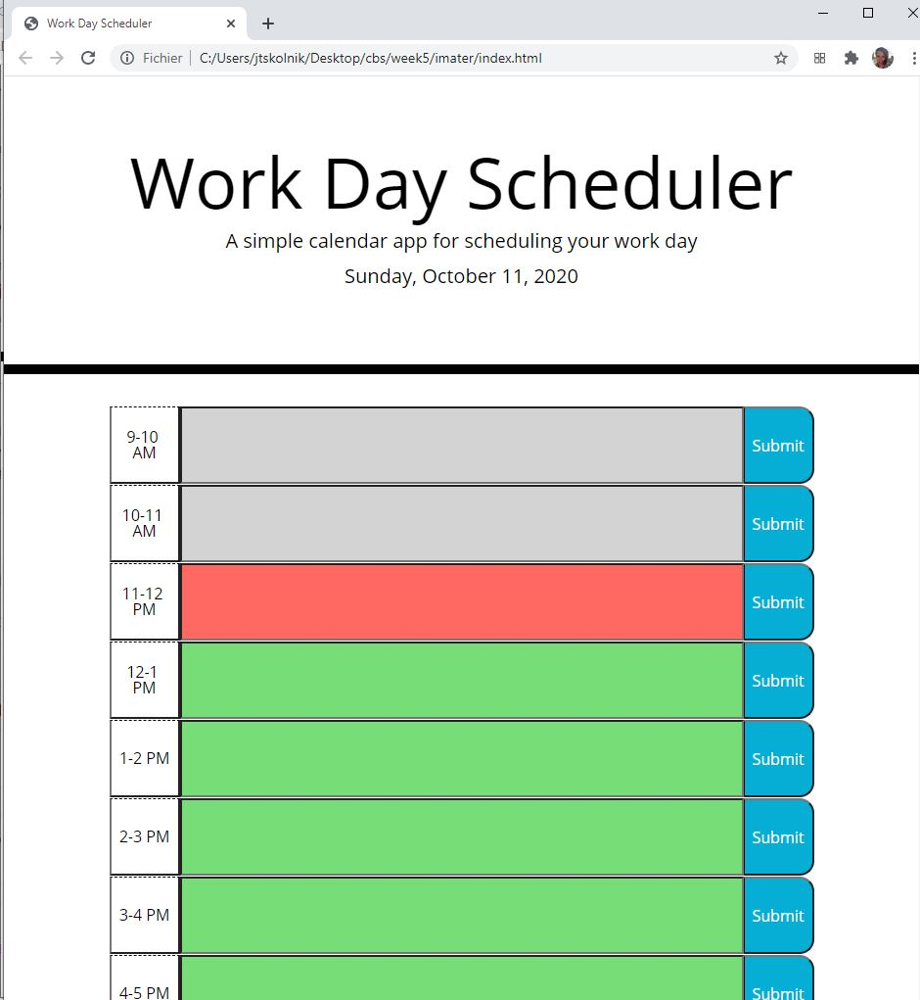

# imater

## Overview

In this program, the user will see the current month, date, and year, as well as an hour-by-hour outline of their work day. As the day progresses, the hours will be color coded, depending on if the hour is past, present or future. This program also allows users to input data and save it such that if they refresh the page, the item will persist. 

[Here is a link to the application](https://skolnikskolnik.github.io/imater/)

### Screenshots

If there are no previously saved items on the list, the user sees the following:

If there is an entry, it will appear upon loading the page

#### Development overview

1. Set up a row for each hour of the day, each row having two buttons and an input with appropriate CSS clases. 

2. Using the date function, display the current date, month, and day of the week. The hour is recorded but not displayed. 

3. Using the stored hour value, each input tag is assigned a class depending if it is past, present, or future

4. Assign each submit button and input an index

5. Create an object to store the index and the user input

6. Add a new item to the object each time a user presses submit

7. Upon starting the page, each input text is displayed depending on the index associated with the input